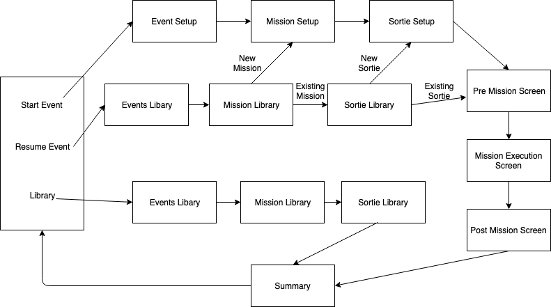
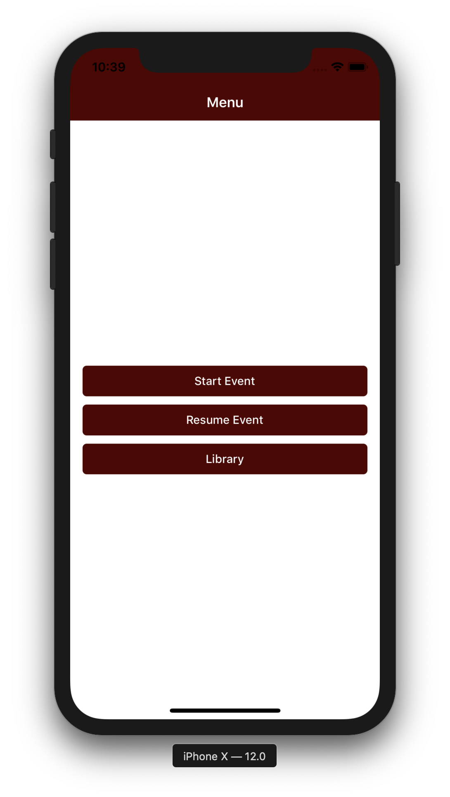
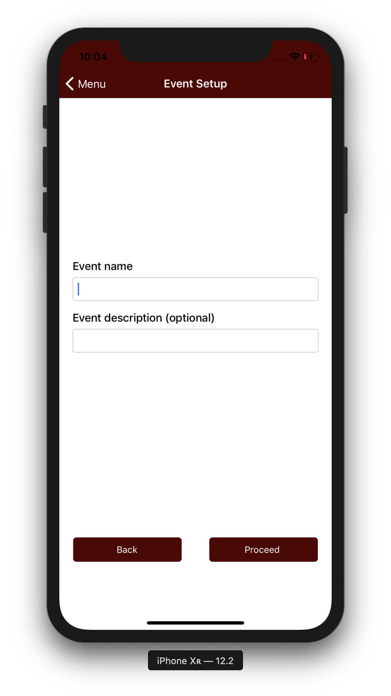
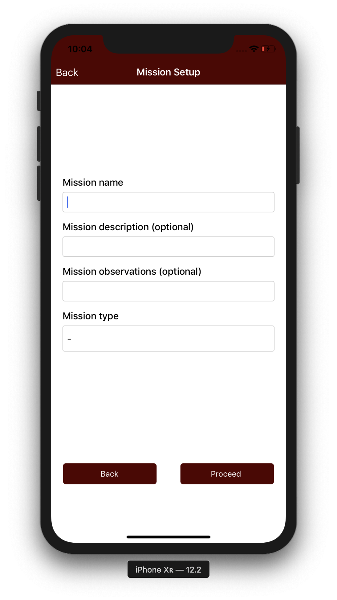
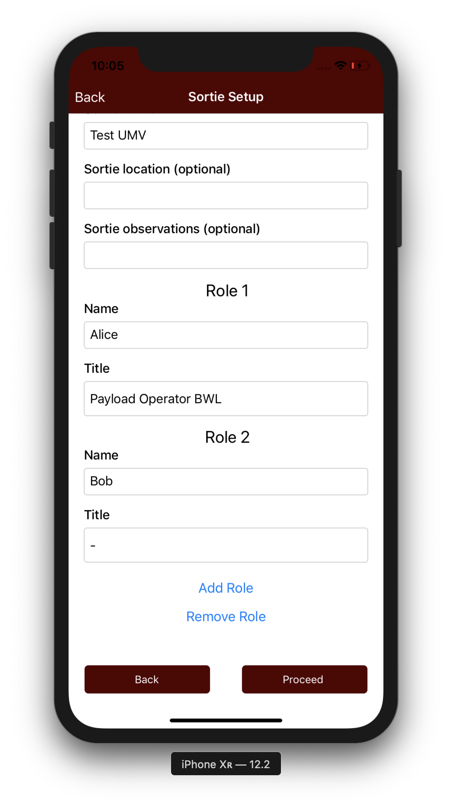
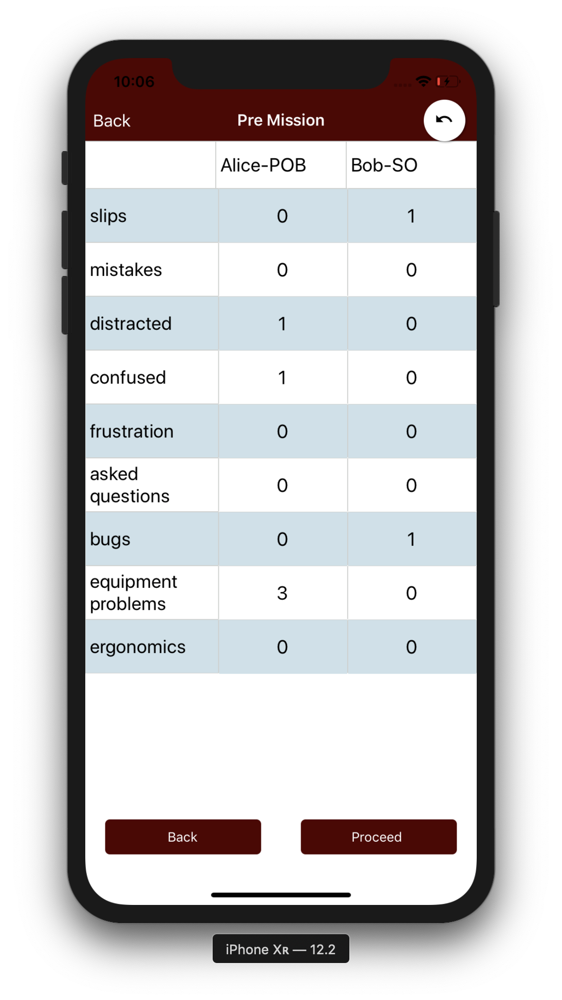
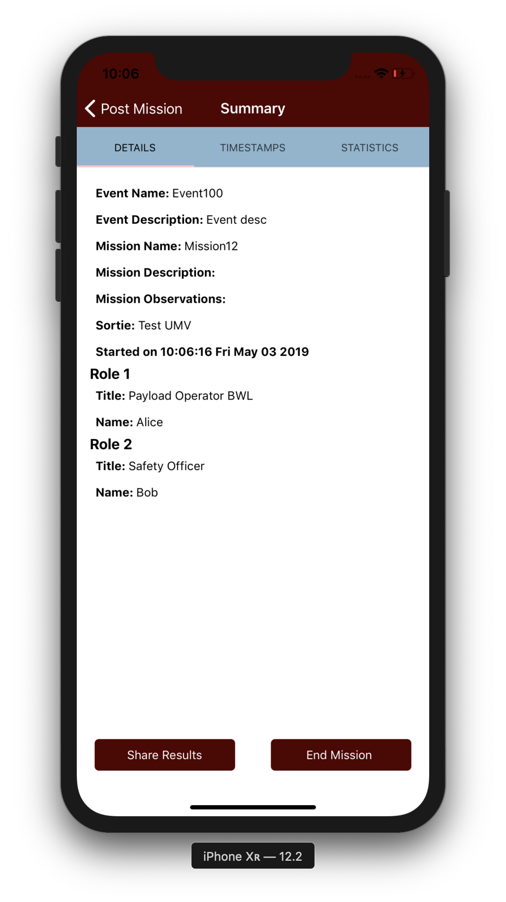
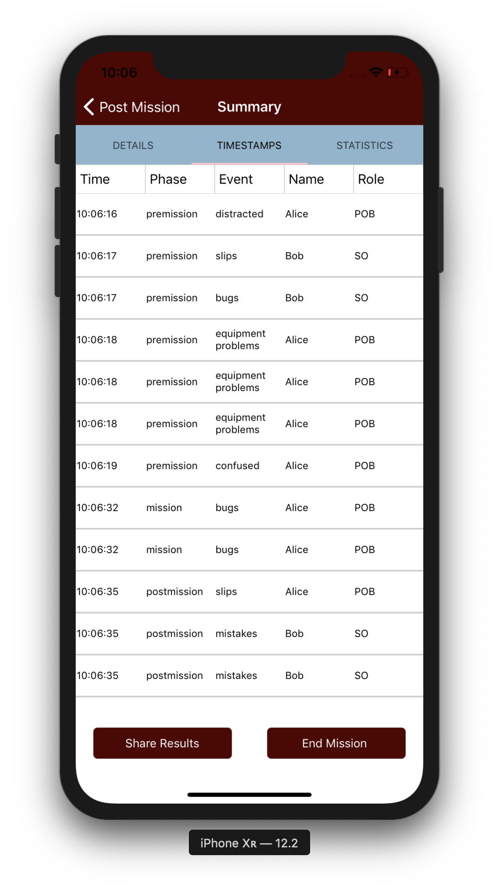
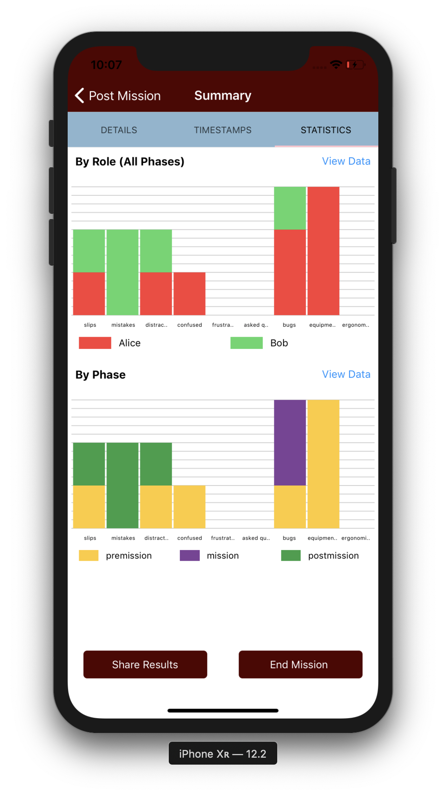
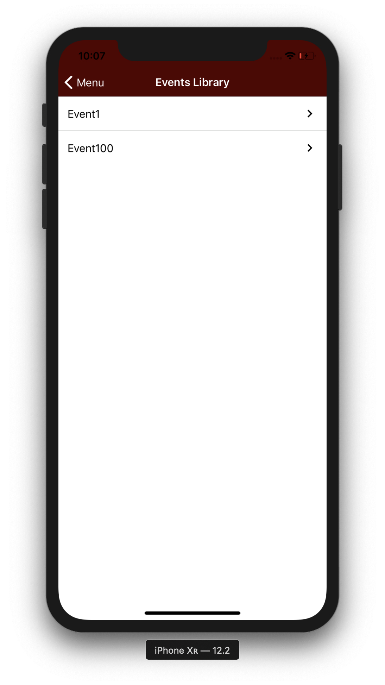

# Human-Robot-Team-Observer-Tool

An application that helps in monitoring Human-Robot Teams involved with disaster robotics. The supervisor can monitor and log behavior of human-robot teams such as bugs, mistakes, distracted etc. These logs can be viewed and shared from the app after it has been completed.

## Understanding the Code
This application is built with React Native. The React Native Javascript files are present as follows:

    .
    ├── App.js
    ├── apis
    │   ├── helper.js
    │   └── values.js
    ├── index.js
    └── screens
        ├── EventSetup.js
        ├── LibraryEvents.js
        ├── LibraryMissions.js
        ├── LibrarySorties.js
        ├── MenuScreen.js
        ├── MissionExecutionScreen.js
        ├── MissionSetup.js
        ├── PostMissionScreen.js
        ├── PreMissionScreen.js
        ├── SortieSetup.js
        ├── SplashScreen.js
        ├── SummaryScreen.js
        └── subviews
            ├── Grid.js
            ├── PhaseGraph.js
            ├── RoleGraph.js
            ├── StickyFooter.js
            ├── SummaryDetails.js
            ├── SummaryStatistics.js
            ├── SummaryTable.js
            └── TableCell.js

### Workflow

### Screens
The application contains the following screens
* #### Menu Screen
The code for the Menu Screen is located in `MenuScreen.js`. The Menu Screen consists of three buttons.
  1. Start Event: This option lets you start a new event. Clicking on this button takes you to the Event Setup Page to input details about the new event.
  1. Resume Event: This option lets you resume an already existing event. Clicking on this button takes you to a list of events that have already been started. You have options to resume an existing mission in an existing event, start a new mission in an existing event, resume an existing sortie in an existing mission or start a new sortie in an existing mission.
  1. Libarary: This option lets you view the details of a completed event.
  
* #### Event Setup Screen
  This page lets you enter the details of a new event such as Event Name and Event Description. The code for the Event Setup Screen Screen is located in `EventSetup.js`.
  
* #### Mission Setup
  This page lets you enter the details of a new mission such as Mission Name, Mission Description, Misson Details and Mission Type. For the mission type, you can choose any of UAV, UMV or UGV. The code for the Mission Setup Screen is located in `MissionSetup.js`.
  
* #### Sortie Setup
    This page lets you enter the details of a new sortie such as Sortie Name, Sortie Descriptiona and Sortie Details. You can also add 1 or more Roles for the sortie. For each of the roles, you can enter Role Name and Role Type. The Role Types will be different for different missions. The code for the Sortie Setup Screen is located in `SortieSetup.js`.
    
* #### Observation Screens
    The next 3 screens in the workflow are the three observation screens: Pre Mission, Mission Execution and Post Mission. These screens are used to log observations for each phase of the sortie respectively. Clicking on the Grid on these pages saves the timestamp of the click. The code for these screens are located at `PreMissionScreen.js`, `MissionExecutionScreen.js`, and `PostMissionScreen.js`.
    
    
    
* #### Summary Screen
    This page shows the summary of a completed sortie. The screen is divided into three subscreen:
    * Details: Shows the details of the sortie,the mission that the event belongs to and the event that the mission belongs to. It also shows the details of all the roles for that sortie.
    
    * Timestamps: Shows the details and timestamps of the observations made for that sortie.
    
    * Statistics: Shows a graphical view of the observations. You can view two graphs: one showing the observations made for differnt roles and one showing the observations per various phases. You can toggle between a graphical view and a tabular view for both the graphs.
    
    
    The base code for the Summary Screen is located at `SummaryScreen.js`, while the code for the subscreens are located at `SummaryDetails.js`, `SummaryTable.js`, and `SummaryStatistics.js` in the subviews folder. for Details, Timestamps and Statisctics respectively.
* #### Library Screens
    The library workflow consists of three screens, to select the Event, Mission and Sortie respectively. If the Library Screens are accessed in the Resume workflow, then the Mission and Sortie Library screens will have an option to add a new Mission and Sortie respectively in addtion to the lists.
    
* #### Sub Views
    To improve modularity, some sub views are provided in the subvies folder. These include the `StickyFooter.js` which contains the code for the footer buttons on most screens, `Grid.js`, which contains the code for the clickable grid on the observation screens, and the graphs for the summary page.
    
## Development
To develop on your local machine, follow the instructions given below. (Watchman and NPM should be installed):
1. Clone the code to your system.
1. Run the following command in a Terminal:
    `npm install -g react-native-cli`
1. To run the app in an iOS simulator (only if XCode is installed), run
    `react-native run-ios`
1. To run the app in an android simulator (only if Android Studio is installed, or an Android app is connected), run
    `react-native run-android`

For more details on how to develop with React Native, [React Native](http://facebook.github.io/react-native/)

The code for the Android App and the iOS apps are in the folders named `android` and `ios` respectively. 
